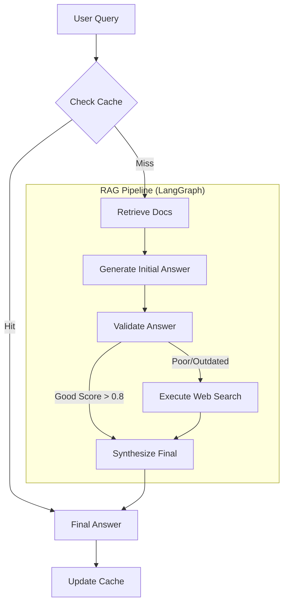

# 🤖 Self-Correcting RAG System

> An advanced Retrieval-Augmented Generation (RAG) pipeline that "thinks" before it speaks. Built with LangGraph, Qdrant, Redis, and Streamlit.


## 📖 Overview

This project implements a **Self-Correcting RAG** system. Unlike standard RAG pipelines that blindly trust retrieved documents, this system employs a multi-agent architecture to:
1.  **Retrieve** information from multiple sources (Wikipedia, ArXiv, Web).
2.  **Generate** an initial answer.
3.  **Validate** the answer for completeness, accuracy, and relevance.
4.  **Self-Correct** by performing targeted web searches if the initial answer is poor or outdated.
5.  **Synthesize** a final, high-quality response.

## ✨ Key Features

- **🧠 Multi-Agent Orchestration**: Powered by **LangGraph** to manage the complex flow of retrieval, generation, and validation.
- **🔍 Hybrid Retrieval**: Combines **Dense Vector Search** (SentenceTransformers) with **Cross-Encoder Re-ranking** for superior accuracy.
- **⚡ Two-Tier Caching (Redis)**:
    - **Tier 1**: Instant responses for identical queries (TTL: 1 hour).
    - **Tier 2**: Cached vector embeddings to reduce compute costs (TTL: 24 hours).
- **🛡️ Self-Correction Loop**: Automatically detects "hallucinations" or missing info and fetches new data.
- **👁️ Full Observability**: Real-time tracking of tokens, latency, and reasoning steps via a custom tracker.
- **💻 Interactive UI**: A beautiful **Streamlit** interface to visualize the entire "Chain of Thought".

## 🏗️ Architecture



## 🛠️ Tech Stack

- **LLM Orchestration**: LangChain, LangGraph
- **Vector Database**: Qdrant (Dockerized)
- **Caching**: Redis (Dockerized)
- **Embeddings**: `all-MiniLM-L6-v2`
- **Re-ranking**: `cross-encoder/ms-marco-MiniLM-L-6-v2`
- **UI**: Streamlit
- **LLM Provider**: Ollama (Local) or OpenAI (Optional)

## 🚀 Getting Started

### Prerequisites
- **Docker & Docker Compose** (for Qdrant and Redis)
- **Python 3.10+**
- **Ollama** (running locally)

### 1. Clone the Repository
```bash
git clone https://github.com/yourusername/self-correcting-rag.git
cd self-correcting-rag
```

### 2. Environment Setup
Create a `.env` file in the root directory:
```env
# LLM Configuration
OLLAMA_BASE_URL=http://localhost:11434
MODEL_NAME=llama3  # or mistral

# Vector DB
QDRANT_URL=http://localhost:6333

# Caching
REDIS_URL=redis://localhost:6379

# Search API (Optional, for web search)
SERPER_API_KEY=your_api_key_here
```

### 3. Install Dependencies
```bash
pip install -r requirements.txt
```

### 4. Start Infrastructure
Start Qdrant and Redis using Docker Compose:
```bash
docker-compose up -d
```

### 5. Ingest Data (Optional)
Ingest some sample ArXiv papers into the vector database:
```bash
python scripts/ingest_arxiv.py
```

### 6. Run the Application
```bash
streamlit run src/ui/app.py
```

## 🖥️ Usage

1.  Open your browser at `http://localhost:8501`.
2.  Type a question (e.g., *"What is the architecture of a Transformer?"*).
3.  **View the Magic**:
    - Click the **"Chain of Thought"** tab to see the system "thinking".
    - Watch it retrieve docs, validate its own answer, and potentially search the web if needed.
4.  **Test Caching**: Ask the same question again to see the "Instant Cache Hit".

## 📂 Project Structure

```
├── src/
│   ├── agents/         # LangGraph agent logic (Graph, Validation, Execution)
│   ├── rag/            # Retrieval (Qdrant) and Generation logic
│   ├── cache/          # Redis caching implementation
│   ├── ui/             # Streamlit application
│   └── observability/  # Custom logging and metrics
├── scripts/            # Data ingestion scripts
├── docker-compose.yml  # Infrastructure setup
└── requirements.txt    # Python dependencies
```

## 🤝 Contributors
- **[Your Name]** - Lead Developer

---
*Built with ❤️ using LangChain and Streamlit*
