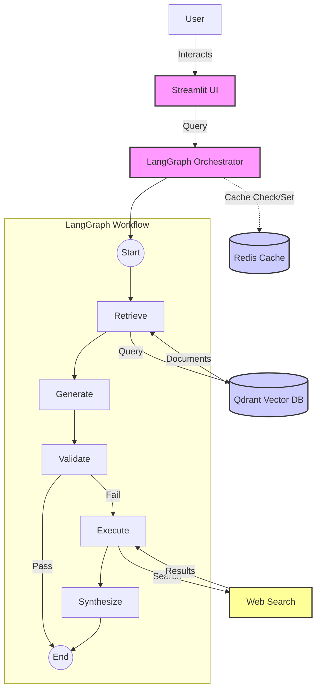

# System Architecture

```mermaid
graph TD
    User[User] -->|Interacts| UI[Streamlit UI]
    UI -->|Query| Orchestrator[LangGraph Orchestrator]
    
    subgraph "LangGraph Workflow"
        Start((Start)) --> Retrieve
        Retrieve --> Generate
        Generate --> Validate
        
        Validate -->|Pass| End((End))
        Validate -->|Fail| Execute
        
        Execute --> Synthesize
        Synthesize --> End
    end
    
    Orchestrator --> Start
    
    Retrieve -->|Query| Qdrant[(Qdrant Vector DB)]
    Qdrant -->|Documents| Retrieve
    
    Execute -->|Search| Web[Web Search]
    Web -->|Results| Execute
    
    Orchestrator -.->|Cache Check/Set| Redis[(Redis Cache)]
    
    classDef component fill:#f9f,stroke:#333,stroke-width:2px;
    classDef database fill:#ccf,stroke:#333,stroke-width:2px;
    classDef external fill:#ff9,stroke:#333,stroke-width:2px;
    
    class UI,Orchestrator component;
    class Qdrant,Redis database;
    class Web external;
```
